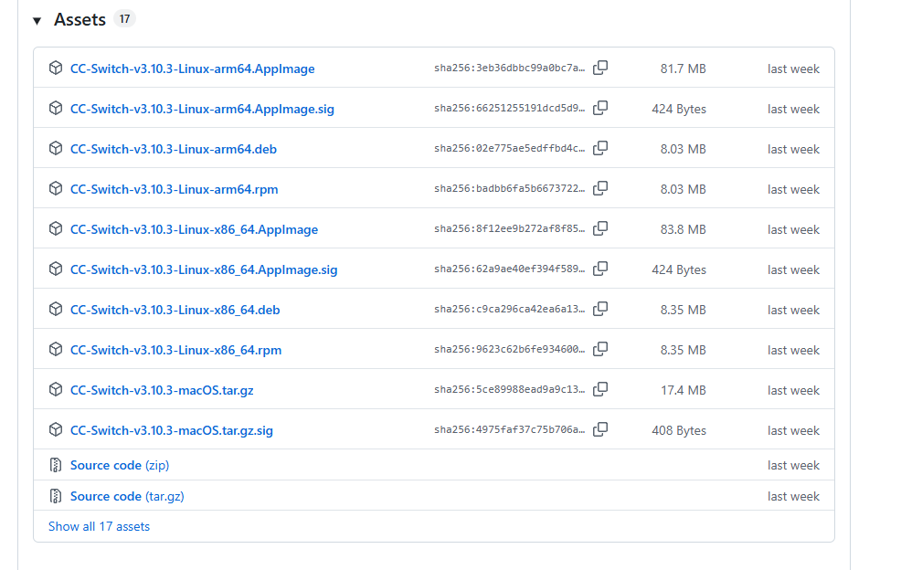
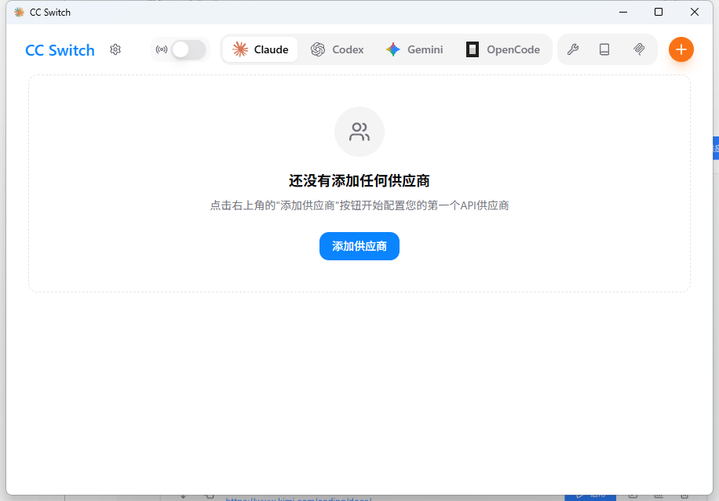
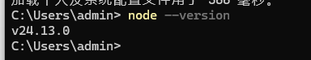
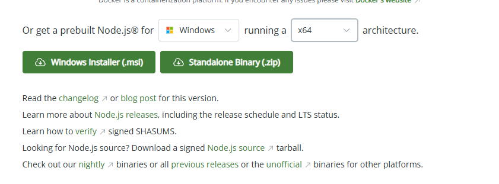
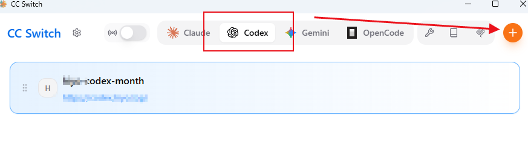
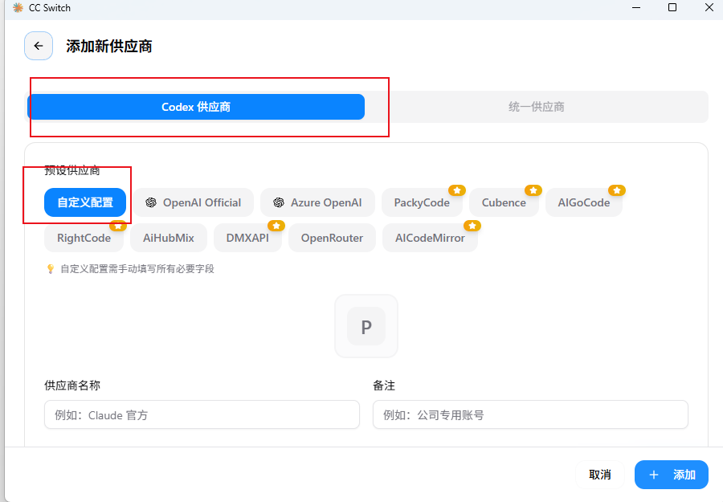
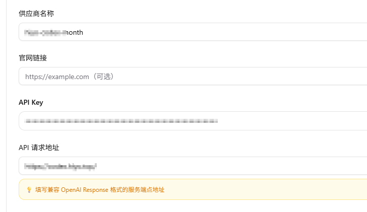

[toc]

# CC-Switch 使用教程（Windows）：用一个界面管理 Codex 的 Key / Base URL

这篇文章面向：你准备在 **Windows** 上使用 Codex（可能是官方，也可能是中转/代理服务），但不想把一堆 Key、请求地址分散在不同地方管理。

你将完成：

- 安装 **CC-Switch**
- （可选）检查 **Node.js** 环境
- 在 CC-Switch 里新增/切换 **Codex** 配置（API Key + Base URL）
- 学会用最小成本排查常见报错（Key、地址、网络三件套）

> 安全提醒：API Key 属于敏感信息。不要截图公开、不要发群、不要上传到公开仓库。

---

## 1. 快速开始（只想跑起来看这一段）

1. 打开 CC-Switch → 进入 **Codex** → 点「+」新增配置
2. 选择你的供应商（或 **自定义**）
3. 填写：
   - `API Key`
   - `Base URL / Endpoint`（以你的服务商文档为准）
4. 保存并切换到该配置

如果后续调用失败，优先按本文第 6 节的“排查顺序”检查。

---

## 2. CC-Switch 是什么？适合谁用？

**CC-Switch** 的核心价值是“集中管理 + 一键切换”：把不同 AI 工具/模型的账号与接口配置放到同一个地方管理，避免到处改配置导致出错。

常见使用场景：

- 同时管理多个工具/客户端（例如 Codex、Claude Code、Gemini 等）的接口配置
- 在不同供应商之间切换（官方 / 中转 / 代理）
- 管理 MCP 服务器、Skills、系统提示词（System Prompt）等（是否支持以你安装的版本为准）

本文重点：在 Windows 上用 CC-Switch 配置 **Codex**，让 Codex 的请求能够正确走到你使用的服务商接口。

---

## 3. 开始前准备（3 分钟确认清单）

建议你先确认下面几项，避免做到一半卡住：

1. 你已经安装 Codex（或准备使用 Codex）
2. 你有可用的 **API Key**
3. 你知道服务商给你的 **Base URL / Endpoint**
4. （可选但推荐）本机已安装 **Node.js**

说明：

- **API Key**：通常长得像一串随机字符（请以实际平台为准）。
- **Base URL / Endpoint**：通常是“接口基础地址”。不同服务商完全不一样；填错基本必失败（401/404/连接失败）。

---

## 4. 下载与安装 CC-Switch（Windows）

1. 打开 CC-Switch 的中文说明（包含功能说明、系统要求与下载入口）：
   - README_ZH.md：<https://github.com/farion1231/cc-switch/blob/main/README_ZH.md>
2. 打开 Releases 页面下载安装包：
   - Releases：<https://github.com/farion1231/cc-switch/releases>
3. 在 Releases 页面往下滚动，找到与你的系统与架构匹配的安装包（例如 Windows x64），然后下载并安装：
   - 参考截图：
     
4. 安装完成后运行 CC-Switch：
   

---

## 5. （可选）检查 Node.js 环境

有些功能可能会依赖 Node.js。你可以先确认一下本机是否已安装。

在 **PowerShell** 或 **CMD** 中运行：

```powershell
node --version
```

- 如果已安装，会输出版本号（例如 `v20.x.x`）：
  
- 如果提示“找不到命令/不是内部或外部命令”，说明未安装 Node.js，可以先安装：
  - 参考教程：<https://www.runoob.com/nodejs/nodejs-install-setup.html>
  - 参考截图：
    

---

## 6. 在 CC-Switch 里新增/切换 Codex 配置

在开始配置前，请先准备好两样东西：

- **API Key**
- **Base URL / Endpoint**

操作步骤：

1. 在 CC-Switch 中找到 **Codex** 入口，点击进入后，再点击「+」新增配置：
   
2. 选择供应商/模型：
   - 列表里有你要用的 **预设供应商**：直接选
   - 列表里没有：选择 **自定义**（按你的服务商要求填写）
   
3. 填写 **API Key** 与 **Base URL / Endpoint**，保存：
   

补充说明（容易踩坑的点）：

- 不同服务商的 **API Key** 与 **Base URL** 完全不通用，请以服务商官方文档为准。
- 如果你使用的是“中转/代理”类服务，确认它提供的是 **兼容协议** 的 Endpoint（例如 OpenAI 兼容），并按它的说明填写 Base URL。
- 调用失败时，不要先怀疑模型；先排查 Key / 地址 / 网络。

---

## 7. 常见问题（推荐排查顺序）

### 7.1 CC-Switch 能打开，但调用失败

按下面顺序检查（从最常见到最省时间）：

1. **Key 是否有效**：是否复制错、是否过期、是否被平台禁用
2. **Base URL 是否写对**：多一个斜杠、少一个版本路径，都可能导致失败
3. **网络是否可达**：公司网络/代理是否放行，DNS 是否正常

### 7.2 我不知道 Base URL 应该填什么

只能去你所使用服务商的文档里查“API Endpoint / Base URL”。不同平台不通用，也不要拿别人的 Base URL 直接套用。

### 7.3 提示未安装 Node.js

按第 4 节安装 Node.js 后，重新打开 CC-Switch 再试。

---

## 8. 术语解释

- **Provider（供应商）**：提供模型接口的服务方（官方/中转/代理都算）。
- **Model（模型）**：你实际调用的 AI 模型名称或版本。
- **MCP（Model Context Protocol）**：一种把外部工具/数据接入到 AI 工具里的协议/机制（不同工具支持程度不同）。
- **Skills**：可理解为插件/扩展，让工具拥有额外能力（例如调用外部服务、执行特定工作流）。
- **System Prompt（系统提示词）**：给 AI 的“全局规则/角色设定”，影响它的回答风格与边界。
- **API Key**：调用接口的密钥（相当于账号密码的一种）。
- **Endpoint / Base URL（请求地址）**：接口请求的基础地址（不同服务商不同，填错会直接连不上）。

