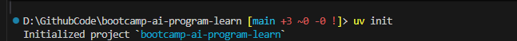
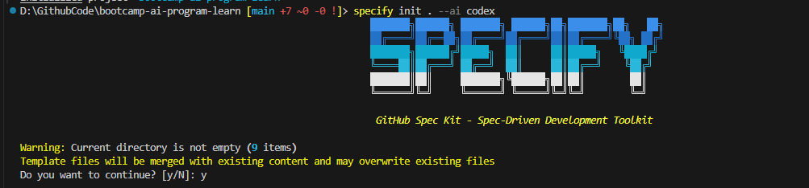
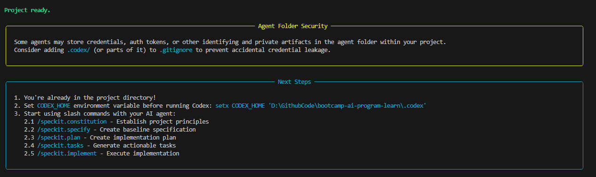
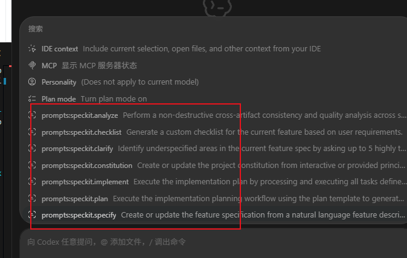
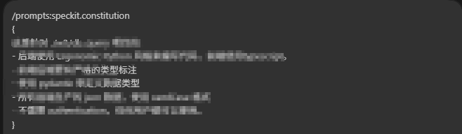
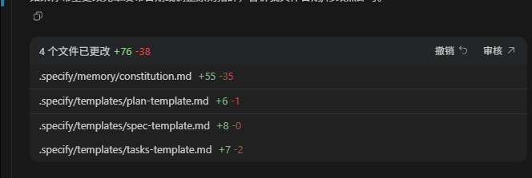
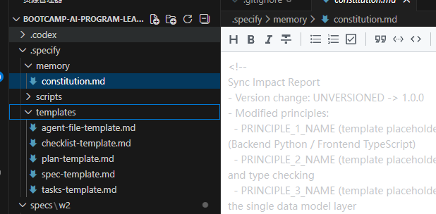
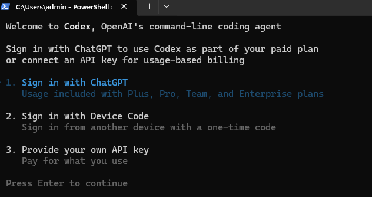
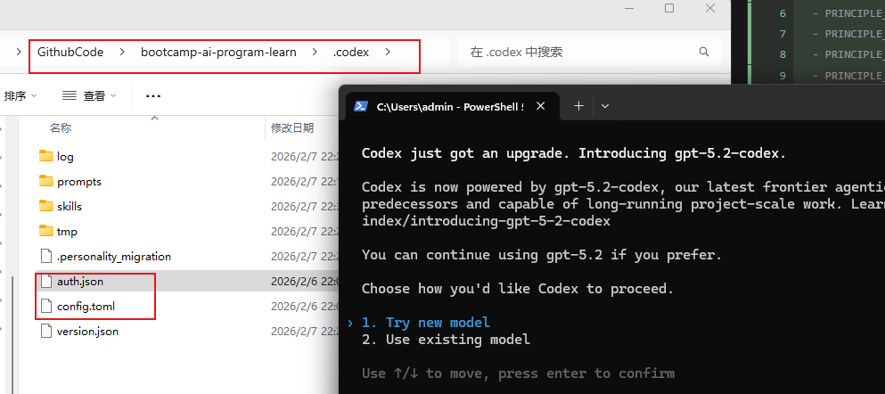

[toc]

# Spec Kit 在 Codex 中简单使用教程（AI 检查和润色版）

> 目标：用 **Spec Kit（`specify` CLI）** 在 **Codex** 里快速初始化项目规范（如 `constitution.md`），并在 VSCode / Codex 里通过 `/` 命令高效生成/维护规范内容。

GitHub 项目地址（上游）：  
`https://github.com/github/spec-kit/tree/main`

---

## 0. 准备工作（建议先检查）

在开始前，建议确认你已经具备以下工具（至少前两个）：

- `git`：用于从 GitHub 安装
- `uv`：用于安装/管理 CLI 工具（本文用它来安装 `specify-cli`）
- `codex`（或 VSCode 的 Codex）：用于在编辑器/终端里调用 Spec Kit 相关命令（例如 `/speckit.constitution`）

可直接执行的检查命令：

```powershell
git --version
uv --version
codex --version
```

如果你的环境里还没有 `codex` 命令，也不影响先完成 Spec Kit 的安装与初始化，只是后续的 `/...` 命令演示需要在 VSCode/Codex 中操作。

---

## 1. 全局安装 Spec Kit CLI（`specify`）

一次安装，随处使用：

```powershell
uv tool install specify-cli --from git+https://github.com/github/spec-kit.git
```

安装完成后，建议验证 `specify` 已可用：

```powershell
specify --help
```

---

## 2. 在项目中初始化 Spec Kit（生成模板/配置）

### 2.1 进入你的项目目录

```powershell
cd D:\path\to\your-project
```

### 2.2 （可选）初始化 `uv` 项目

原文里提到 `uv init`。这里需要澄清：

- `uv init` **不是 Spec Kit 必需步骤**（Spec Kit 是否要求 `pyproject.toml` 取决于你后续如何使用它）。
- 如果你希望把这个仓库当作一个 Python 项目来管理依赖、脚本等，执行 `uv init` 会更顺手。

可选命令：

```powershell
uv init
```

### 2.3 初始化 Spec Kit（面向 Codex）

在项目根目录执行：

```powershell
specify init . --ai codex
```

初始化后会生成/更新一些文件（包含 `constitution.md` 等）。**注意：重复执行 `specify init` 可能覆盖已有模板文件**，如果你已手工修改过，建议先提交到 Git 或备份再执行。

对应截图（保留原文截图路径）：





### 2.4 可能需要代理（网络问题）

如果安装或初始化过程中出现无法访问 GitHub、下载失败等情况，通常与网络/代理有关。你可以先确保：

- 你的 Git/终端可以访问 `github.com`
- 如果公司网络需要代理，先在系统/终端配置好代理再重试

原文截图：



---

## 3. 配置 `CODEX_HOME`（让 Codex 读取正确的配置/技能）

### 3.1 `CODEX_HOME` 是什么？

`CODEX_HOME` 是 Codex 用来定位配置目录的环境变量。设置后，Codex 会从该目录读取/写入配置（例如 `config.toml`、`auth.json` 等）。

这也意味着：**一旦你把 `CODEX_HOME` 指向了新的目录，Codex 就不再使用默认目录下的登录与供应商配置**，可能会出现“重新登录”的现象（见后面的常见问题）。

### 3.2 推荐：只在当前终端会话临时设置（更安全）

临时设置只对当前 PowerShell 窗口生效，关闭窗口后自动失效，最不容易影响其它工具（比如你提到的 CC-Switch）。

```powershell
$env:CODEX_HOME = "D:\GithubCode\bootcamp-ai-program-learn\.codex"
```

验证：

```powershell
echo $env:CODEX_HOME
```

### 3.3 持久化：写入用户环境变量（慎用）

如果你希望所有新开的终端都生效，可以用 `setx` 写入用户环境变量（注意：**只对新开终端生效**）。

```powershell
setx CODEX_HOME "D:\GithubCode\bootcamp-ai-program-learn\.codex"
```

原文截图（保留）：



---

## 4. 在 VSCode / Codex 中触发 Spec Kit 命令

### 4.1 用 `/` 调出可用命令

在 VSCode 的 Codex 面板中，输入 `/` 通常可以调出可用命令列表（以你的插件版本/配置为准）。

原文截图（保留）：


### 4.2 示例：`/speckit.constitution`

运行 `/speckit.constitution` 后，会根据你在对话里的输入生成/更新一份新的 `constitution.md`（或对应的规范文件）。

原文截图（保留）：



执行输出示例（保留）：





### 4.3 关于 `constitution.md` 被覆盖的风险（重点）

原文信息很关键，这里把逻辑说得更直白一点：

- `constitution.md` 初始是一份模板
- 再次执行 `specify init` 可能会重新生成并覆盖它
- `/speckit.constitution` 会根据你输入的需求生成新的规范内容

建议工作流：

1. 先运行一次 `specify init . --ai codex` 生成模板
2. 再通过 `/speckit.constitution` 逐步完善规范
3. **不要频繁重复 `specify init`**（除非你明确知道会覆盖哪些文件）

---

## 5. 常见问题与解决方案

### 5.1 设置 `CODEX_HOME` 后，`codex` 又要求登录了

现象（原文截图）：



原因：  
你的登录信息/供应商配置通常保存在默认目录（例如 `C:\Users\<你的用户名>\.codex`）下的 `config.toml`、`auth.json` 等文件里。  
当你把 `CODEX_HOME` 指到新目录时，新目录里没有这些文件，Codex 会认为是“新环境”，因此提示重新登录。

解决方式（两种选一种）：

**方式 A：把旧配置复制到新的 `CODEX_HOME`（原文方案）**

1. 找到默认配置目录（把 `admin` 换成你自己的 Windows 用户名）：
   - `C:\Users\<你的用户名>\.codex`
2. 将 `auth.json`、`config.toml` 复制到你设置的 `CODEX_HOME` 目录下

原文截图（保留）：



注意：  
如果你之前是通过 **CC-Switch** 来管理供应商配置，复制配置文件到新目录可能会让 CC-Switch 的修改“看起来不生效”（因为它可能仍在改默认目录下的配置）。这时你需要二选一：

- 让 CC-Switch 也指向同一个 `CODEX_HOME`（如果它支持）
- 或者不要持久化设置 `CODEX_HOME`，改用临时 `$env:CODEX_HOME` 用完就关

**方式 B：用完 Spec Kit 后取消 `CODEX_HOME`**

只取消当前会话（PowerShell）：

```powershell
Remove-Item Env:CODEX_HOME -ErrorAction SilentlyContinue
```

如果你之前用 `setx` 做了持久化，需要到系统环境变量里删除，或者把它改成你希望的路径。

### 5.2 Git 提交时不要把 `.codex` 带进仓库

如果你把 `CODEX_HOME` 放在项目目录内（例如项目根下的 `.codex`），建议在仓库的 `.gitignore` 中加入：

```gitignore
.codex/
```

这样不会把个人的登录信息、配置文件提交到远程仓库。

### 5.3 文档在 PowerShell 里显示乱码

如果你用 PowerShell 5.x 的 `Get-Content` 直接查看 Markdown，可能会因为默认编码导致中文乱码。可改用：

```powershell
Get-Content -Raw -Encoding UTF8 "SpecKit在Codex中简单使用教程.md"
```

---

## 6. FAQ

**Q1：必须执行 `uv init` 吗？**  
A：不必须。`uv init` 更偏向“把目录初始化为 Python 项目”，Spec Kit 的 `specify init` 本身不一定依赖它。

**Q2：`CODEX_HOME` 推荐设置到哪里？**  
A：更推荐设置到一个“专用目录”，不要放在会被 Git 管理的项目目录里，避免配置泄露/污染仓库。例如：`D:\Tools\codex-home\.codex`。

**Q3：为什么我在 VSCode 里输入 `/` 看不到命令？**  
A：通常与 VSCode 的 Codex 插件版本、是否启用相关功能、以及 `CODEX_HOME`/配置是否正确有关。建议先确认：

- VSCode 里的 Codex 能正常对话
- `CODEX_HOME` 指向的目录中包含可用的配置与命令定义（若你的安装方式依赖这些）

---

## 7. 术语解释（统一汇总）

- **Spec Kit**：GitHub 的一个规范化工具/模板体系，用来帮助项目生成并维护工程规范、需求文档等。
- **`specify-cli` / `specify`**：Spec Kit 的 CLI 工具包名与命令名（本文用 `uv tool install` 安装）。
- **Codex**：用于与模型交互并执行工具/命令的客户端（可在终端或 VSCode 中使用）。
- **`CODEX_HOME`**：Codex 的配置目录环境变量；设置后会改变 Codex 读取配置（如登录、供应商、命令）的路径。
- **`config.toml` / `auth.json`**：Codex 常见的配置/认证文件（具体内容因版本/安装方式不同而异）。
- **CC-Switch**：你当前使用的“供应商/配置切换”工具或机制（文中按原文称呼保留）。
- **中转版 Codex**：你提到的“中转 Codex”用法/发行版/配置方式的统称（通常指通过第三方或中转服务接入不同模型供应商）。
- **`constitution.md`**：项目规范/章程类文档（模板 + 生成内容），用于约束模型在项目里的行为与输出风格。
- **代理（Proxy）**：用于解决网络无法直连 GitHub 时的访问问题（公司网络/特殊网络环境常见）。
